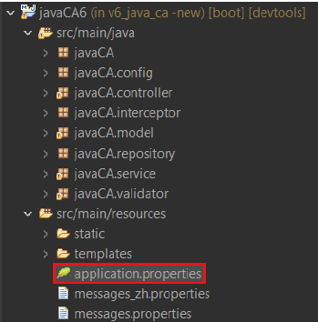
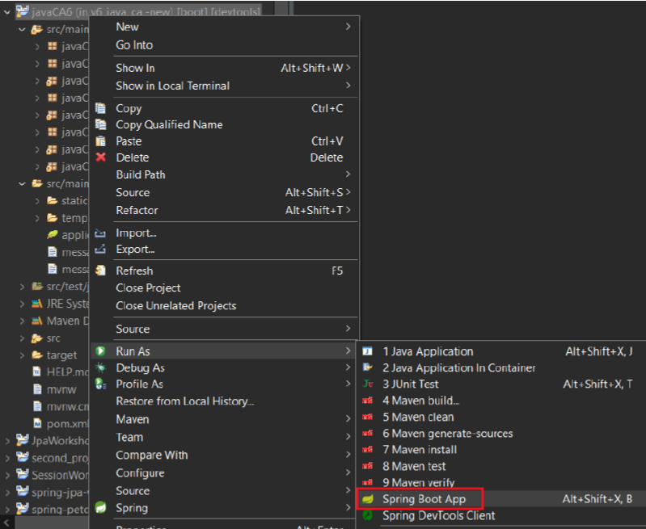

1. In the 'application.properties' file, change the username and password to your account in MySql.

2. In MySql, create a database with the same name. For example: 'leavesystem'.

3. Run as 'Spring Boot App'.

4. Test the application with the following account:
   
   | Username | Password |       Role        |
   |----------|----------|-------------------|
   | admin    | password |       admin       |
   | esther   | password | staff and manager |
   | tin      | password |       staff       |
